# Azure AI/ML Deployment

## Architecture

### Provisioning

### Data Science Workflow

```mermaid
graph LR;
  style scientist text-align:left
  style azml text-align:center
  scientist[🙋‍♀️\n👩‍🔬 Data Scientists\n🧑‍💻] --Git Push--> repo[Pipeline Repository\non GitHub]
  scientist --interactive-->studio
  scientist --Copy In-->data
  subgraph azml[Azure Machine Learning Workspace\nPaaS]
    studio[Azure ML Studio\nJupyter Notebooks]
    compute[Compute Node]
    style computeC fill:#F77,stroke:#F00,stroke-width:2px
    style computeP text-align:left
    subgraph computeC[Compute Cluster]
      computeP[Prebuilt\n - small\n - medium\n - large]
      computeD[Dynamic]
    end
  end
  repo --> compute
  compute[Job Submission\nCluster] -. generate .->computeD
  compute -. utilize .->computeP

  studio -->compute

  computeC --Writes-->results
  computeC <--Reads--> data
  subgraph sa[Storage Account]
    results[Results]
    data[Data Sets]
  end
```

## Workflow

* Devops deploys infrastructure with Terraform
* Researchers interact with ML Workspace using either a GitHub pipeline, or interactively with a Jupyterlabs notebook

### Github Action Examples

* 2 scripts located in a [separate repository](https://github.com/jimwood/azureml-examples) forked from official AzureML examples
* Repository secrets contain Azure Service Principal credentials and pointers to the Azure ML Workspace
* Examples:
  * Pipeline job to process NYC Taxi Data: ([job definition](https://github.com/jimwood/azureml-examples/tree/main/cli/jobs/pipelines/nyc-taxi)) ([workflow](https://github.com/jimwood/azureml-examples/blob/main/.github/workflows/cli-jobs-pipelines-nyc-taxi-pipeline.yml))
    * Demonstrates deploying a multi-step pipeline to the workspace
    * Configured with the name of a known compute cluster within the workspace
    * Not Azure specific, could be any workload suitable for the specified cluster
  * Command job to analyze Bank Data: ([job definition](https://github.com/jimwood/azureml-examples/tree/main/cli/jobs/single-step/dynamic-compute/bank-data)) ([workflow](https://github.com/jimwood/azureml-examples/blob/main/.github/workflows/cli-jobs-single-step-bank-data-job.yml))
    * Taken from a Jupyter Notebook defined in the workspace and modified to run unattended
    * Runs a single step on a known compute cluster in the workspace designed to handle self-provisioning jobs
    * Uses azureml Python SDK to self provision an appropriately sized compute cluster within the workspace
    * Programmatically runs multi-step process passing inputs and outputs forward