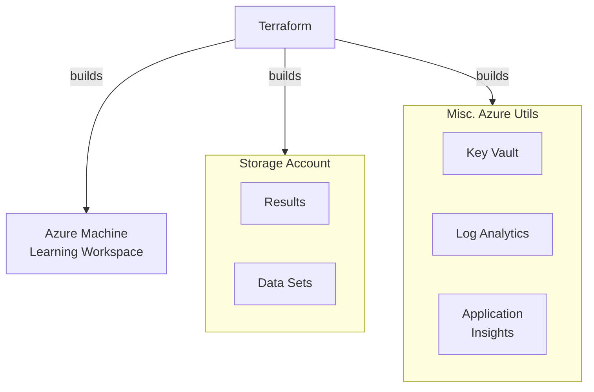

# Azure AI/ML Deployment

## Architecture

🏆 Worlds Ugliest Diagrams 🏆

### Provisioning

### Data Science Workflow

```mermaid
graph LR;
  scientist[🙋‍♀️👩‍🔬🧑‍💻 Data Scientists] --Git Push--> repo[Pipeline Repository\non GitHub]
  scientist -->azml
  scientist --Copy In-->data
  subgraph azml[Azure Machine\nLearning Workspace]
    compute[Compute Node]
    computeC[Compute Cluster]
  end
  repo --> azml
  compute[Compute Node ] -->computeC[Compute Cluster]
  computeC --Writes-->results
  computeC <--Reads--> data
  subgraph sa[Storage Account]
    results[Results]
    data[Data Sets]
  end
```

## TODO

Handle blob storage for holding data/models - Data asset points to this

Terraform Templates
- Spin up data science machine
- Get blob storage credentials
- Kubernetes Cluster with 10x machines, etc

JupyterLab instance Kubernetes orchestration

ML/AI Expert
- Write something that breaks the ML/AI thing out

Also maybe cost analysis?
